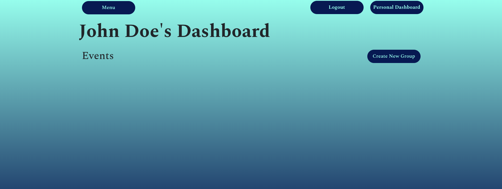
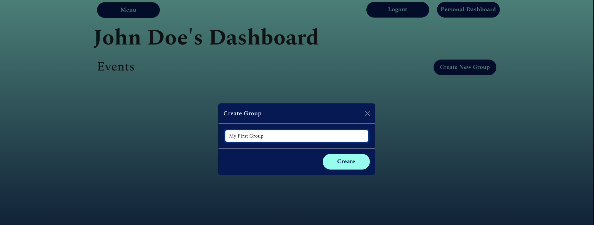
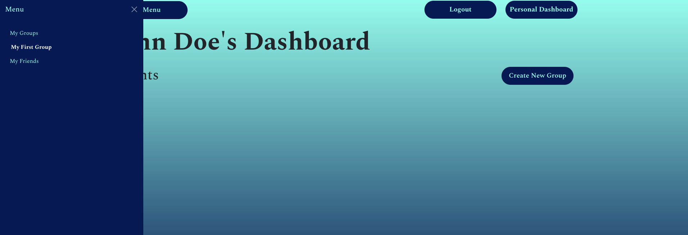
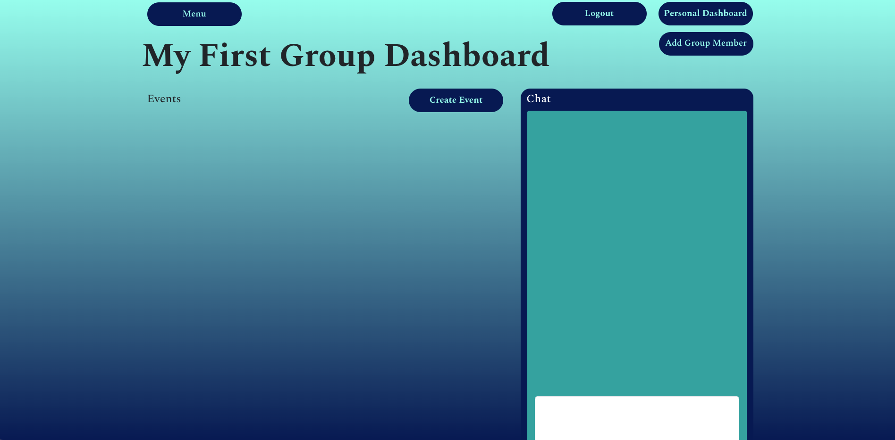
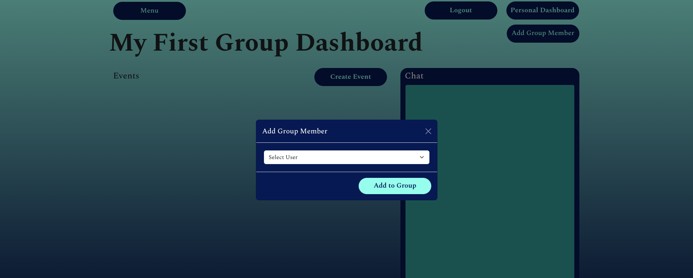
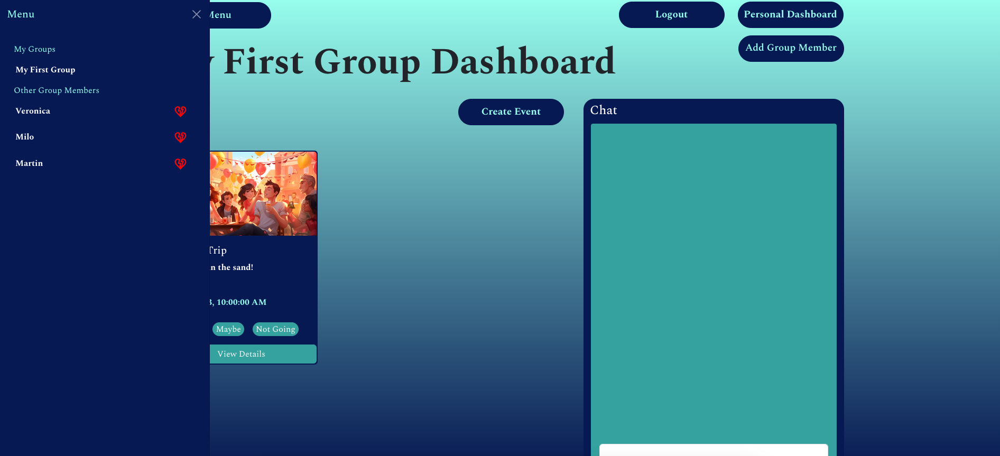
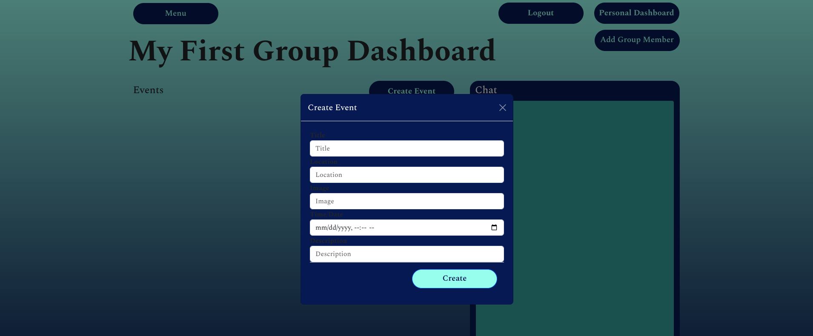
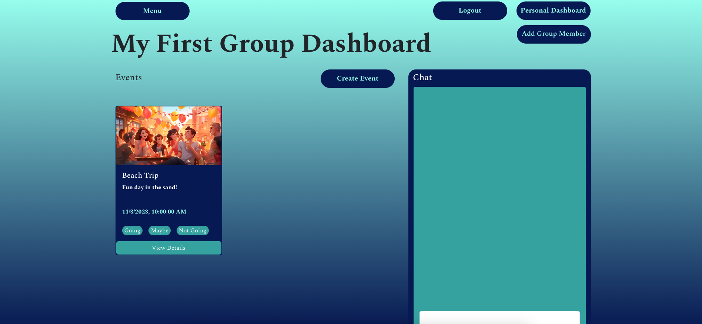
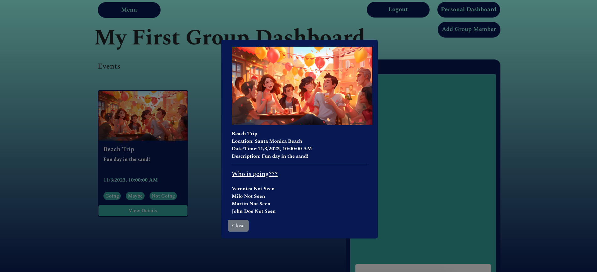
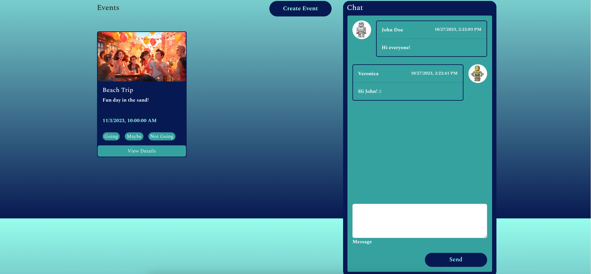

## Login/Sign Up
This is the first page a user will see when they visit our website. They can either log in, or create a new account.

## Personal Dashboard
Once logged in, the user will automatically be directed to their personal dashboard.

## Create A New Group
Inside the personal dashboard, a user can create a new group by clicking on the "Create New Group" button. They will then fill out the form with a group name and click create.

## Group Dashboard
Once the new group is created, the user can navigate to the group dashboard by clicking on the group name that has been added to the menu on the left hand side under "My Groups".

## Add/Delete Group Members
In the group dashboard the user can add people to the group by clicking on the "Add Group Member" button on the top right hand corner. This will display a modal where you can select a user from the drop down and add them to the group.

The user can view all the members in the group by clicking on the menu button on the left hand side and expanding the "Other Group Members" tab. You can even delete a group member by clicking on the broken heart next to their name, however, only the group admin has the ability to delete group members.

## Create An Event
Within the group dashboard, the user can create a new event by clicking on the "Create Event" button. The will see the following modal, where they can fill out all the details for the event.

Once the event is created, the event card will be displayed on the group dashboard.

To expand the event card, click on "View Details".

## Chat
The user can also chat with other group members using the chat feature on the right hand side.

